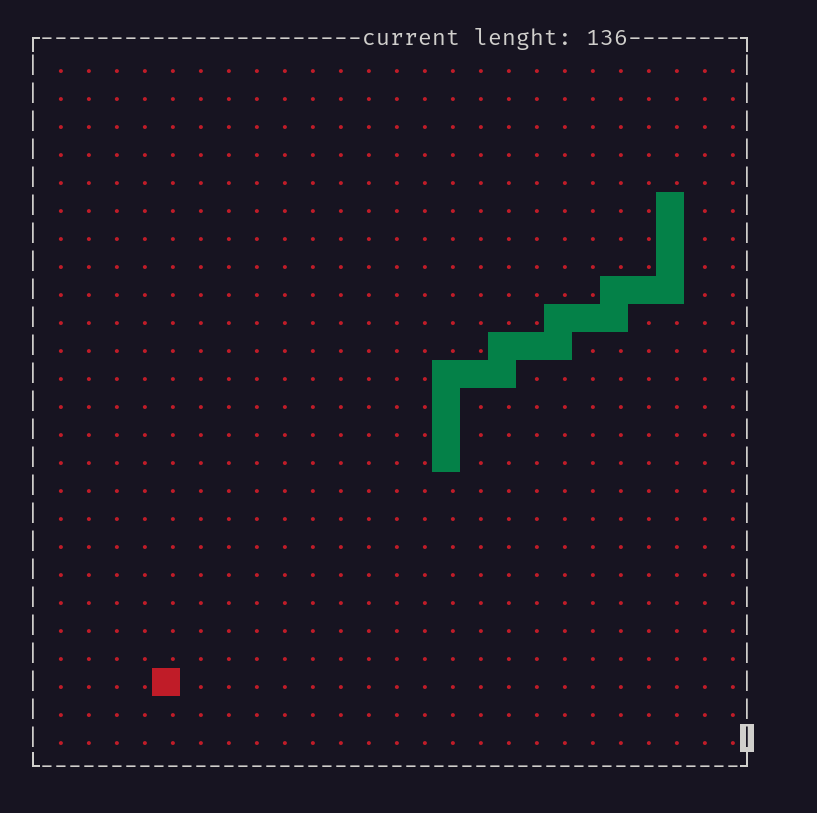

# Classic console Snake game
---

I wrote this game after reading book about programming in Linux system "Linux programming" writing by Neil Matthiew and Richard Stones. One of the themes discussed in this book was the creation of console applications using the ncurses library. It caught my attention because I believed that creating preety looks nice applications was tedious and time-consuming. This game is an example of the capabilities of the ncurses library. Of course, the library is designed for creating console application interfaces for Unix-like systems such as Linux and macOS. However, with Docker, you can test my game on Windows

### How to run this game on your machine ?

If you using machine with linux or mac os, you can download source of this game install ncurses library on your machine (in linux is only one command ;)) and you can compile this game using this command (of course you need g++ compiler):

```bash
g++ snake.cpp -o snake -lncurses
```

If you using Docker, you can also download sources and build docker image (I used Ubuntu but recommend you to consider something lighter like alpine), to build this image you can use following command:

```bash
docker build -t snake .
```

and then run as container using following command:

```bash
docker run -it --rm snake
```

You can also download the ready image with the game from my Docker Hub (monio359 is my another mysterious nickname ;)).

```bash
docker pull monio359/snakeforlinux:1.0.0
```

 I wish you to enjoy this game, and I hope you might feel like adding something cool to this project (for example cool main menu would be great :))

 ## How it looks like



